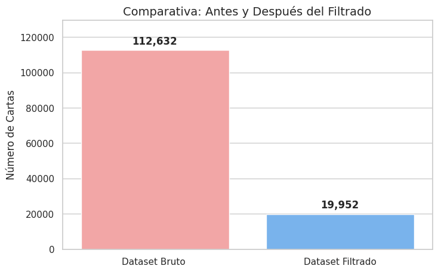
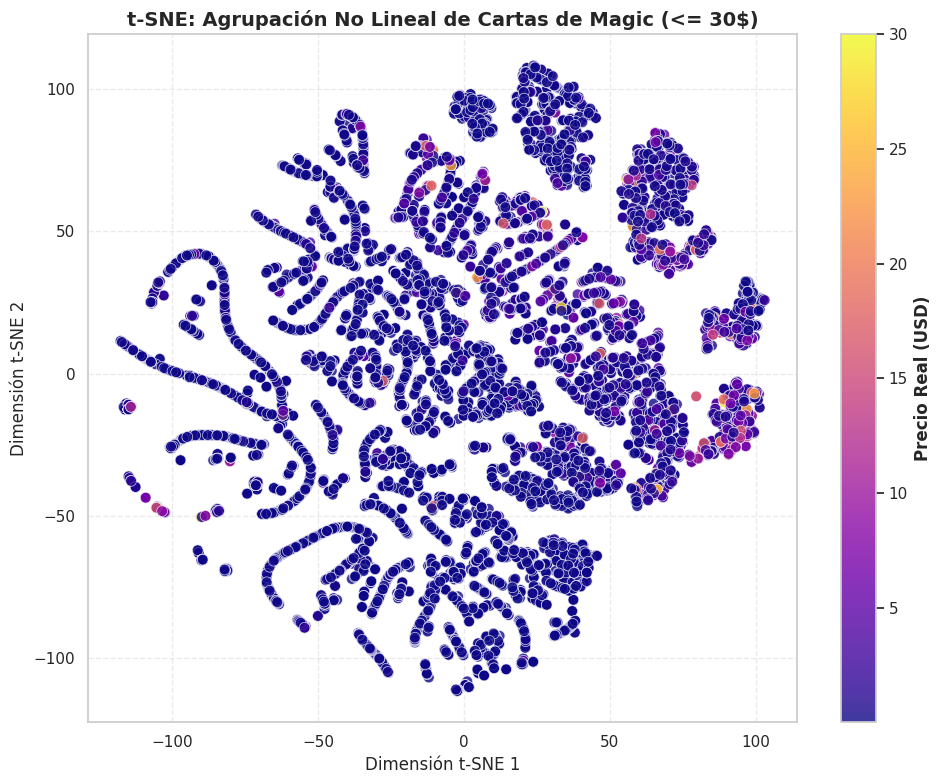

# 🧙‍♂️ Magic: The Gathering - Price Prediction & Market Analysis

🌍 _Read this in other languages: [English](README.md) | [Español](README.es.md)_


## 📌 Overview

This project applies Machine Learning techniques and Exploratory Data Analysis (EDA) to predict the market value of **Magic: The Gathering** cards. Using the official Scryfall API, the model extracts, cleans, and analyzes over 300,000 records to discover how a card's physical statistics influence its price.

## 🎯 Project Goals

1. **Price Prediction:** Train a Random Forest model (`RandomForestRegressor`) to estimate the price of standard cards.
2. **Outlier Handling:** Demonstrate how the collector's market (cards > $30) distorts predictions and how to solve this using domain clipping.
3. **Dimensionality Reduction:** Use **PCA** and **t-SNE** to visualize the market in 2D and 3D, discovering "niches" and card clusters based on their features.

## 📊 Key Results

By separating collector cards (noise) from playable cards (signal), the optimized model achieved a drastic improvement:

- **Base Model (With Outliers):** Unable to generalize the price due to cards with anomalous historical value (exorbitant error and prediction scale).
- **Optimized Model (Cards <= $30):** The Mean Absolute Error (MAE) was significantly reduced. It demonstrates that stats like Power, Toughness, Mana Cost, and Rarity do explain the price in the standard player market.



## 🧠 Architecture and Data Flow

1. **Extraction:** Direct connection to Scryfall's Bulk Data API (no need to download heavy files of hundreds of MBs when cloning the repo).
2. **Feature Engineering:** Conversion of color arrays, text length calculation (`oracle_text`), and numerical mapping of rarities.
3. **Modeling:** `RandomForestRegressor` scaled with `StandardScaler`.
4. **Interpretability:** Principal Component Analysis (PCA Loadings) using heatmaps and non-linear clustering with t-SNE.



## 📁 Repository Structure

mtg-price-predictor/ <br>
├── data/ # Data folder (automatic download via API)<br>
├── images/ # Charts generated by EDA and model evaluation<br>
├── notebooks/  
│ └── mtg_price_model.ipynb # Main notebook with code and explanations<br>
├── .gitignore # Files ignored by Git<br>
├── requirements.txt # Project dependencies<br>
├── README.md # Project documentation (English)<br>
└── README.es.md # Project documentation (Spanish)

## 🚀 How to run this project

1. Clone the repository:

   ```bash
   git clone https://github.com/NicoRuedaA/MTG-price-prediction.git
   cd MTG-price-prediction
   ```

2. Navigate to the project directory:
   ```bash
   cd mtg-price-predictor
   ```
3. Install the required dependencies:
   ```bash
   pip install -r requirements.txt
   ```
4. Open the Jupyter Notebook:
   ```bash
   jupyter notebook notebooks/mtg_price_model.ipynb
   ```
   Note: The notebook will automatically connect to the Scryfall API on the first run to work with the latest market data.

## 🛠️ Technologies Used

- **Data Manipulation:** `pandas`, `requests`
- **Machine Learning:** `scikit-learn` (RandomForest, PCA, t-SNE, SimpleImputer, StandardScaler)
- **Visualization:** `matplotlib`, `seaborn`, `plotly` (interactive 3D charts)

---

**Developed by Nico Rueda**
